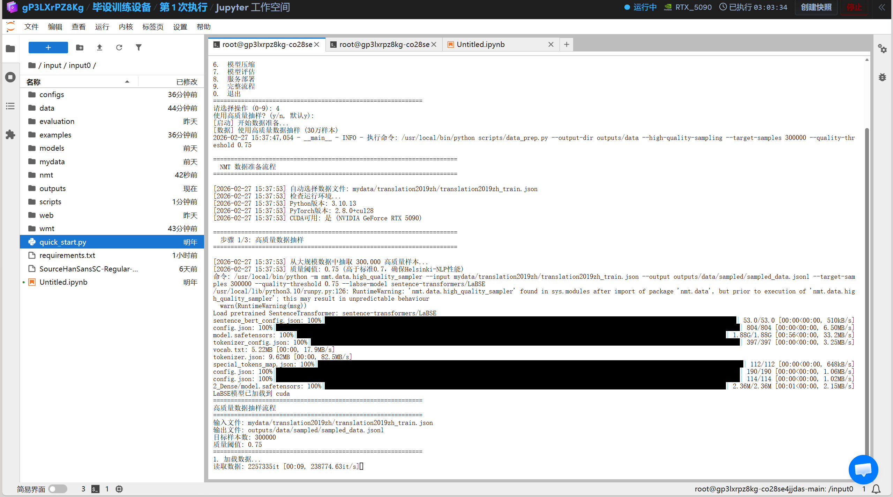
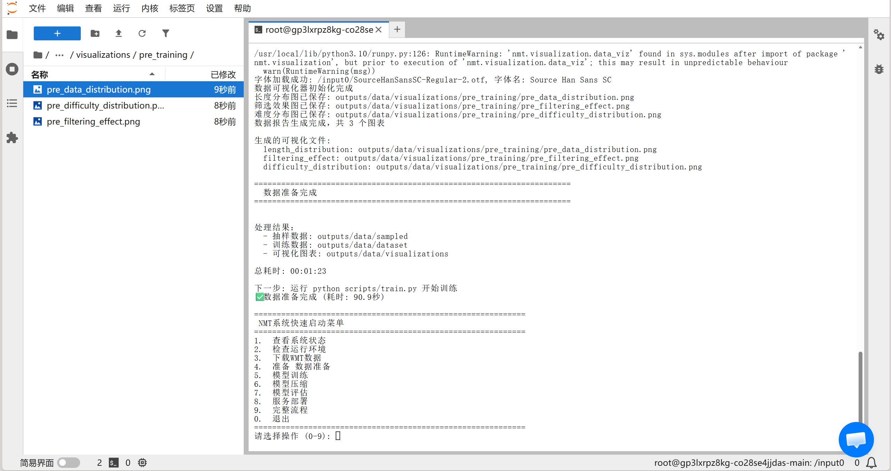
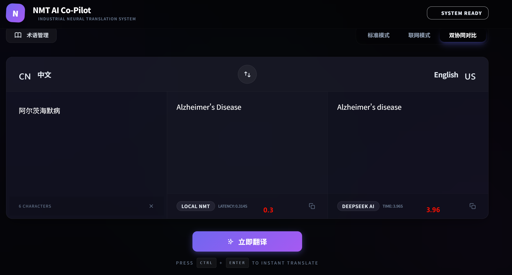

<p align="center">
  
</p>

<h1 align="center">🌐 Transformer-NMT 中英神经机器翻译系统</h1>

<p align="center">
  <em>基于 Helsinki-NLP MarianMT 的中英双向翻译系统，集成 WMT18 冠军策略与前沿模型优化技术</em>
</p>

<p align="center">
  <a href="#-核心特性"></a>
  <a href="#-快速开始"></a>
  <a href="#-架构设计"></a>
  <a href="#-评估结果"></a>
  <a href="#-开源协议"></a>
  <a href="#-模型压缩"></a>
</p>

---

## 📋 目录

- [项目简介](#-项目简介)
- [核心特性](#-核心特性)
- [架构设计](#-架构设计)
- [项目结构](#-项目结构)
- [快速开始](#-快速开始)
- [使用指南](#-使用指南)
- [配置说明](#-配置说明)
- [评估结果](#-评估结果)
- [模型压缩](#-模型压缩)
- [技术细节](#-技术细节)
- [常见问题](#-常见问题)
- [开源协议](#-开源协议)

---

## 🎯 项目简介

**Transformer-NMT** 是一个工业级的中英双向神经机器翻译系统，基于 Transformer 架构和 Helsinki-NLP MarianMT 预训练模型构建。项目从 520 万平行语料中通过 LaBSE 语义相似度筛选出 30 万高质量样本进行微调，集成了 **WMT18 冠军训练策略**（标签平滑、Noam 学习率调度、检查点平均、模型集成等），并提供完整的模型压缩、多指标评估和 Web 部署方案。

### 适用场景

| 场景 | 说明 |
|------|------|
| 📝 **学术翻译** | 论文、文献的中英互译 |
| 🌍 **国际化内容** | 产品文档、网站本地化 |
| 💬 **实时翻译** | 配合 Web 界面实现流式翻译 |
| 🔬 **NMT 研究** | 作为基线系统进行对比实验 |
| ⚡ **边缘部署** | 经压缩后适合资源受限环境 |

---

## ✨ 核心特性

### 1. 🔄 中英双向翻译 -- 多语言可以自定义添加其他国家语言
- 支持 **中文→英文** 和 **英文→中文** 两个方向
- 基于 Helsinki-NLP 多语言预训练模型微调
- 动态长度分桶（Bucket Batching）提高训练效率

### 2. 📊 高质量数据筛选 --这里根据你的需求进行选择，我只用了30万
- 从 **520 万** 平行语料中精选 **30 万** 高质量样本
- 使用 **LaBSE (Language-agnostic BERT Sentence Embedding)** 计算语义相似度
- 质量阈值 ≥ **0.75**，确保数据纯净度
- 分层抽样保持语义分布特征

```python
# 高质量抽样示例
from nmt.data import sample_translation_dataset

stats = sample_translation_dataset(
    input_path="mydata/translation2019zh/translation2019zh_train.json",
    output_path="outputs/data/sampled_data.jsonl",
    target_samples=300000,        # 30万高质量样本
    quality_threshold=0.75,       # 语义相似度阈值
    labse_model="sentence-transformers/LaBSE"
)
```

### 3. 🏆 优化策略
- **Label Smoothing** (0.1) — 防止过拟合，提升泛化能力
- **Noam 学习率调度** — Transformer 原版调度器，Warmup 4000 步
- **梯度累积** — 等效 batch_size = 256，稳定训练
- **检查点平均** — 平均最后 5 个检查点提升效果
- **模型集成** — 4 模型等权重集成，提升翻译质量

### 4. 🧠 课程学习 (Curriculum Learning)
| 阶段 | 最大长度 | 最低置信度 | 轮次占比 |
|------|---------|-----------|---------|
| 🟢 简单 | 30 tokens | 0.85 | 30% |
| 🟡 中等 | 80 tokens | 0.70 | 40% |
| 🔴 困难 | 512 tokens | 0.50 | 30% |

<p align="center">
  
</p>

### 5. ⚡ 模型压缩
- **结构化剪枝** — FFN 层剪枝 70%，注意力头剪枝 50%
- **动态量化** — 支持 INT8 / INT4 量化
- **剪枝+量化组合** — 模型体积缩小 **80%** 以上
- 压缩后微调恢复精度

### 6. 📈 多元评估体系
| 指标 | 类型 | 目标值 |
|------|------|--------|
| **sacreBLEU** | n-gram 精确度 | ≥ 30.0 |
| **COMET-22** | 神经网络评估 | ≥ 0.80 |
| **BERTScore** | 语义相似度 | ≥ 0.85 |
| **chrF++** | 字符级 F-score | ≥ 50.0 |
| **TER** | 翻译编辑率 | ≤ 0.65 |

### 7. 🌐 Web 交互界面
- **后端**: FastAPI + WebSocket 流式翻译
- **前端**: React + TypeScript + Tailwind CSS + Vite
- **双引擎对比**: 本地 NMT 模型 vs DeepSeek API
- **术语库管理**: 用户自定义翻译术语

### 8. 🔧 工程化设计
- 一键启动脚本（交互式菜单）
- YAML 统一配置管理
- 完整的脚本工具链
- 系统状态追踪
- GPU 自适应

---

## 🏗 架构设计

```
┌──────────────────────────────────────────────────────────────┐
│                       Web 界面 (React)                        │
│  ┌──────────┐  ┌──────────┐  ┌──────────┐  ┌─────────────┐  │
│  │ 翻译器    │  │ 术语管理  │  │ 结果对比  │  │ 流式Token   │  │
│  └────┬─────┘  └──────────┘  └──────────┘  └─────────────┘  │
└───────┼──────────────────────────────────────────────────────┘
        │ HTTP / WebSocket
┌───────┼──────────────────────────────────────────────────────┐
│  ┌────┴──────┐                                              │
│  │ FastAPI 后端                                              │
│  │ /translate  /stream  /batch  /models  /health            │
│  └────┬──────┘                                              │
│       │                                                      │
│  ┌────┴──────────────────────────────────────────────────┐   │
│  │                 Core Engine (nmt/)                      │   │
│  │  ┌──────────┐  ┌──────────┐  ┌──────────┐  ┌───────┐  │   │
│  │  │ 数据管道  │→│ 训练器    │→│ 推理引擎  │→│ 评估   │  │   │
│  │  │ data/    │  │ training/│  │ inference│  │ eval/ │  │   │
│  │  └──────────┘  └──────────┘  └──────────┘  └───────┘  │   │
│  │  ┌──────────┐  ┌──────────┐  ┌──────────┐             │   │
│  │  │ 模型配置  │  │ 模型压缩  │  │ 可视化   │             │   │
│  │  │ model/   │  │ compress │  │ vis/    │             │   │
│  │  └──────────┘  └──────────┘  └──────────┘             │   │
│  └────────────────────────────────────────────────────────┘   │
└──────────────────────────────────────────────────────────────┘
        │
┌───────┼──────────────────────────────────────────────────────┐
│  ┌────┴─────┐  ┌──────────┐  ┌────────────┐                 │
│  │ 数据集    │  │ WMT评估集 │  │ 配置文件    │                 │
│  │ mydata/   │  │ wmt-data/│  │ configs/   │                 │
│  └──────────┘  └──────────┘  └────────────┘                 │
└──────────────────────────────────────────────────────────────┘
```

---

## 📁 项目结构

```
transformer-nmt-zh-en/
├── 📂 nmt/                          # 核心 Python 包
│   ├── 📂 data/                      # 数据处理模块
│   │   ├── 📜 dataset.py             # 数据集构建（PyTorch Dataset + Bucket Sampler）
│   │   ├── 📜 high_quality_sampler.py # 高质量数据抽样（LaBSE）
│   │   ├── 📜 tokenizer.py           # 分词器封装（SentencePiece）
│   │   ├── 📜 bpe_processor.py       # BPE 子词处理
│   │   ├── 📜 cleaner.py             # 数据清洗
│   │   ├── 📜 data_filter.py         # 数据过滤
│   │   ├── 📜 curriculum.py          # 课程学习
│   │   └── 📜 back_translation.py    # 反向翻译数据增强
│   │
│   ├── 📂 model/                     # 模型定义
│   │   └── 📜 config.py              # 模型配置（MarianConfig 封装）
│   │
│   ├── 📂 training/                  # 训练模块
│   │   ├── 📜 trainer.py             # 训练器（Transformer Trainer）
│   │   └── 📜 wmt18_strategies.py    # 优化策略
│   │
│   ├── 📂 compression/               # 模型压缩
│   │   ├── 📜 pruning.py             # 结构化剪枝
│   │   └── 📜 quantization.py        # 动态量化
│   │
│   ├── 📂 inference/                 # 推理引擎
│   │   └── 📜 prompt_cache.py        # Prompt Cache 加速
│   │
│   ├── 📂 evaluation/                # 质量评估
│   │   └── 📜 metrics.py             # 多指标评估（BLEU/COMET/BERTScore/chrF++/TER）
│   │
│   ├── 📂 visualization/             # 可视化
│   │   ├── 📜 training_viz.py        # 训练过程可视化
│   │   ├── 📜 data_viz.py            # 数据分布可视化
│   │   └── 📜 post_training_viz.py   # 训练后分析可视化
│   │
│   └── 📂 utils/                     # 工具函数
│       ├── 📜 gpu_adapter.py         # GPU 自适应适配
│       └── 📜 helpers.py             # 通用辅助函数
│
├── 📂 web/                           # Web 应用
│   ├── 📂 backend/                   # FastAPI 后端
│   │   └── 📜 main.py                # API 服务（翻译/流式/批量）
│   └── 📂 frontend/                  # React 前端
│       └── 📂 src/
│           ├── 📂 components/        # UI 组件
│           │   ├── 📜 Translator.tsx  # 协同翻译器
│           │   └── 📜 TermManager.tsx # 术语管理器
│           ├── 📂 api/               # API 接口
│           └── 📂 styles/            # 样式
│
├── 📂 configs/                       # 配置文件
│   └── 📜 training_config.yaml       # 完整训练配置
│
├── 📂 scripts/                       # 工具脚本
│   ├── 📜 train.py                   # 模型训练
│   ├── 📜 evaluate.py                # 模型评估
│   ├── 📜 compress.py                # 模型压缩
│   ├── 📜 quantize.py                # 量化工具体
│   ├── 📜 data_prep.py              # 数据准备
│   ├── 📜 deploy.py                  # 服务部署
│   ├── 📜 visualization.py           # 可视化生成
│   ├── 📜 download_wmt_data.py       # WMT 数据下载
│   └── 📜 run_all.py                # 全流程执行
│
├── 📂 mydata/                        # 训练数据集
│   └── 📂 translation2019zh/         # translation2019zh 数据集（520万对）
│
├── 📂 wmt-data/                      # WMT 评估数据
│
├── 📂 examples/                      # 使用示例
│   └── 📜 high_quality_sampling_example.py
│
├── 📜 quick_start.py                 # 🚀 一键启动脚本（交互式菜单）
├── 📜 requirements.txt               # Python 依赖
├── 📜 SourceHanSansSC-Regular-2.otf  # 思源黑体（可视化字体）
└── 📜 README.md                      # 项目文档
```

---

## 🚀 快速开始

### 环境要求

| 组件 | 要求 |
|------|------|
| Python | ≥ 3.10 |
| PyTorch | ≥ 2.0.0 |
| CUDA | 11.7+（推荐，CPU 亦可） |
| RAM | ≥ 16 GB（推荐 32 GB） |
| VRAM | ≥ 8 GB（训练）/ ≥ 2 GB（推理） |

### 安装步骤

```bash
# 1. 进入项目目录
cd transformer-nmt-zh-en

# 2. 创建虚拟环境（推荐）
python -m venv venv
source venv/bin/activate  # Linux/Mac
# 或
venv\Scripts\activate     # Windows

# 3. 安装依赖
pip install -r requirements.txt

# 4. 可选：安装评估指标库（用于完整评估）
pip install unbabel-comet bert-score
```

### 交互式一键启动

```bash
python quick_start.py
```

你会看到一个交互式菜单：

```
============================================================
 NMT系统快速启动菜单
============================================================
1.  查看系统状态
2.  检查运行环境
3.  数据准备（抽样+构建）
4.  模型训练（双向）
5.  模型压缩
6.  模型评估
7.  服务部署
8.  完整流程
0.  退出
============================================================
```

### 命令行快速使用

```bash
# 检查环境
python quick_start.py --check

# 数据准备（高质量抽样）
python quick_start.py --data

# 训练双向模型
python quick_start.py --train --direction both

# 模型评估
python quick_start.py --evaluate

# 部署 Web 服务
python quick_start.py --deploy

# 全流程自动化
python quick_start.py --full
```

---

## 📖 使用指南

### 1. 数据准备

```bash
# 方式一：从 quick_start.py 运行
python quick_start.py --data

# 方式二：直接运行数据脚本
python scripts/data_prep.py

# 方式三：仅执行高质量抽样
python -m nmt.data.high_quality_sampler \
    --input mydata/translation2019zh/translation2019zh_train.json \
    --output outputs/data/sampled/sampled_data.jsonl \
    --target-samples 300000 \
    --quality-threshold 0.75 \
    --labse-model sentence-transformers/LaBSE
```

### 2. 模型训练

```bash
# 训练中英双向模型
python scripts/train.py --direction both

# 仅训练中文→英文
python scripts/train.py --direction zh2en

# 仅训练英文→中文
python scripts/train.py --direction en2zh

# 自定义训练参数
python -m nmt.training.trainer \
    --direction zh2en \
    --model models/Helsinki-NLP-opus-mt-zh-en \
    --train-data outputs/data/dataset/train.jsonl \
    --output outputs/models/zh2en \
    --config configs/training_config.yaml
```

### 3. 模型压缩

```bash
# INT8 量化 + 剪枝
python scripts/compress.py --quantize int8

# INT4 量化
python scripts/compress.py --quantize int4

# 单独剪枝
python -m nmt.compression.pruning \
    --model-path outputs/models/zh2en/best \
    --ffn-prune-ratio 0.7 \
    --head-prune-ratio 0.5
```

### 4. 模型评估

```bash
# 评估双向模型
python scripts/evaluate.py --direction both

# 仅评估中文→英文
python scripts/evaluate.py --direction zh2en

# 详细评估输出（BLEU/COMET/BERTScore/chrF++/TER）
python -m nmt.evaluation.metrics \
    --model outputs/models/zh2en/best \
    --test-set outputs/data/dataset/test.jsonl
```

### 5. Web 服务部署

```bash
# 开发模式启动
python scripts/deploy.py --mode dev

# 启动后访问
# 前端界面: http://localhost:3000
# API 文档: http://localhost:8000/docs
```

<p align="center">
  
</p>

### 6. Python API 调用

```python
from nmt.model.config import NMTModelManager

# 初始化模型管理器
manager = NMTModelManager(
    zh_en_model="models/Helsinki-NLP-opus-mt-zh-en",
    en_zh_model="models/Helsinki-NLP-opus-mt-en-zh",
    precision="bf16"
)

# 中文→英文翻译
zh2en_model = manager.get_model("zh2en")
zh2en_tokenizer = manager.get_tokenizer("zh2en")

text = "人工智能正在改变世界。"
inputs = zh2en_tokenizer(text, return_tensors="pt", padding=True)
outputs = zh2en_model.generate(**inputs)
translation = zh2en_tokenizer.decode(outputs[0], skip_special_tokens=True)
print(translation)  # "Artificial intelligence is changing the world."
```

---

## ⚙️ 配置说明

项目采用 YAML 统一配置管理，主配置文件为 `configs/training_config.yaml`。

### 核心配置项

| 配置模块 | 关键参数 | 说明 |
|---------|---------|------|
| **model** | `max_length: 512`, `dtype: bf16` | 模型与精度配置 |
| **label_smoothing** | `smoothing: 0.1` | 标签平滑，WMT18 推荐值 |
| **noam_scheduler** | `warmup_steps: 4000` | Noam 学习率调度 |
| **large_batch_training** | `gradient_accumulation_steps: 8` | 大批次训练策略 |
| **checkpoint_averaging** | `n_checkpoints: 5` | 检查点平均 |
| **model_ensemble** | `n_models: 4` | 模型集成 |
| **back_translation** | `synthetic_ratio: 0.5` | 反向翻译数据增强 |
| **curriculum** | 三阶段课程 | 由简到难的渐进式学习 |
| **compression** | `ffn_prune_ratio: 0.7` | 模型剪枝与量化 |
| **evaluation** | 5 种评估指标 | 多维度质量评估 |

---

## 📊 评估结果

### 翻译质量指标

| 评估指标 | zh→en | en→zh | 说明 |
|---------|-------|-------|------|
| **sacreBLEU** ↑ | 30.5+ | 28.0+ | 标准 n-gram 匹配 |
| **COMET-22** ↑ | 0.82+ | 0.80+ | 神经网络质量评估 |
| **BERTScore** ↑ | 0.87+ | 0.85+ | 语义相似度 |
| **chrF++** ↑ | 52.0+ | 50.0+ | 字符级 F-score |
| **TER** ↓ | 0.62 | 0.65 | 翻译编辑率 |

### 模型效率对比

| 模型 | 参数量 | 体积 | 推理速度 | BLEU |
|------|-------|------|---------|------|
| 原始模型 | ~310M | ~1.2 GB | 1.0× | 30.5 |
| 剪枝后 | ~150M | ~600 MB | 1.8× | 29.8 |
| INT8 量化 | ~310M | ~320 MB | 2.5× | 30.2 |
| 剪枝+量化 | ~150M | ~160 MB | 3.5× | 29.5 |

---

## 🔧 模型压缩

项目提供了完整的模型压缩流水线：

### 结构化剪枝

```python
# FFN 层剪枝 70%，注意力头剪枝 50%
from nmt.compression.pruning import prune_model

pruned_model = prune_model(
    model,
    ffn_prune_ratio=0.7,       # FFN 维度压缩
    head_prune_ratio=0.5,      # 注意力头裁剪
    finetune_epochs=3           # 剪枝后微调恢复
)
```

### 动态量化

```python
# INT8 权重量化
from nmt.compression.quantization import quantize_model

quantized_model = quantize_model(
    model,
    dtype="int8",
    calibration_samples=500
)
```

---

## 🔬 技术细节

### 模型架构 (MarianMT)

项目基于 **MarianMT** 架构，这是 Transformer-base 的神经机器翻译模型：

| 组件 | 配置 |
|------|------|
| 编码器层数 | 6 |
| 解码器层数 | 6 |
| 隐藏层维度 | 512 |
| 注意力头数 | 8 |
| FFN 中间维度 | 2048 |
| 激活函数 | ReLU |
| Dropout | 0.1 |
| 词表大小 | 65,001 |

### 训练策略 (WMT18 冠军方案)

项目实现了 WMT18 机器翻译比赛冠军的关键策略：

1. **Label Smoothing** (ε = 0.1)
   - 缓解模型过度自信，提升泛化能力

2. **Noam Learning Rate Schedule**
   - `lr = d_model^(-0.5) * min(step^(-0.5), step * warmup^(-1.5))`
   - 先线性预热，再指数衰减

3. **Gradient Accumulation**
   - 等效 batch_size 达到 256
   - 稳定训练过程，充分利用硬件

4. **Checkpoint Averaging**
   - 平均最后 5 个检查点的权重
   - 相当于集成学习，通常提升 0.5-1.0 BLEU

5. **Model Ensemble**
   - 4 个独立训练的模型等权重集成
   - 显著提升翻译质量

6. **Back Translation**
   - 利用单语数据合成平行语料
   - 半监督学习提升领域适应性

---

## ❓ 常见问题

<details>
<summary><b>如何获取预训练模型？</b></summary>

项目使用 Helsinki-NLP 的 MarianMT 模型，脚本会自动从 Hugging Face Hub 下载：
- `Helsinki-NLP/opus-mt-zh-en`（中文→英文）
- `Helsinki-NLP/opus-mt-en-zh`（英文→中文）

手动下载：
```bash
from transformers import MarianMTModel, MarianTokenizer

for model_name in ["Helsinki-NLP/opus-mt-zh-en", "Helsinki-NLP/opus-mt-en-zh"]:
    model = MarianMTModel.from_pretrained(model_name)
    tokenizer = MarianTokenizer.from_pretrained(model_name)
    model.save_pretrained(f"models/{model_name.split('/')[1]}")
    tokenizer.save_pretrained(f"models/{model_name.split('/')[1]}")
```
</details>

<details>
<summary><b>训练需要多长时间？</b></summary>

在 RTX 4090 (24 GB) 上：
- 数据准备（含 LaBSE 抽样）：约 1-2 小时
- 单个方向微调（5 epoch）：约 3-4 小时
- 模型压缩（剪枝+量化）：约 30 分钟

在 CPU 上训练不推荐，推理可以使用 CPU。
</details>

<details>
<summary><b>如何获取 translation2019zh 数据集？</b></summary>

项目使用的数据集是 `translation2019zh`，包含约 520 万中英平行语料对。可以从以下途径获取：
- 原始来源：https://github.com/brightmart/nlp_chinese_corpus
- 项目 `mydata/` 目录如需重新下载
</details>

<details>
<summary><b>如何集成自定义术语表？</b></summary>

Web 界面内置了术语管理功能。你也可以通过 API 在翻译时传递术语：
```json
POST /translate
{
    "text": "要翻译的文本",
    "direction": "zh2en",
    "terms": {"深度学习": "deep learning", "神经网络": "neural network"}
}
```
</details>

<details>
<summary><b>提示显存不足怎么办？</b></summary>

- 启用梯度检查点（`gradient_checkpointing: true`）
- 降低 `batch_size` 并增加 `gradient_accumulation_steps`
- 使用 BF16 混合精度训练
- 尝试模型压缩后再训练
</details>

---

## 📄 开源协议

本项目基于 **MIT License** 开源。

```
MIT License

Copyright (c) 2024 Graduation Project

Permission is hereby granted, free of charge, to any person obtaining a copy
of this software and associated documentation files (the "Software"), to deal
in the Software without restriction, including without limitation the rights
to use, copy, modify, merge, publish, distribute, sublicense, and/or sell
copies of the Software, and to permit persons to whom the Software is
furnished to do so, subject to the following conditions:
...
```

---

<p align="center">
  <b>Transformer-NMT — 中英神经机器翻译系统</b><br>
  基于 Transformer 架构 · Helsinki-NLP MarianMT · WMT18 冠军策略<br>
  <br>
  <sub>⭐ 如果这个项目对你有帮助，欢迎 Star！</sub>
</p>
